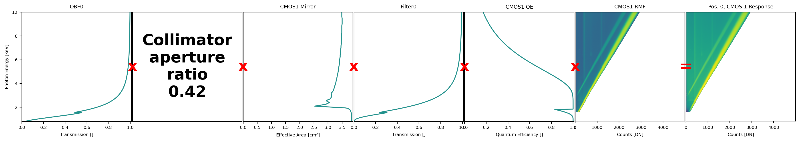
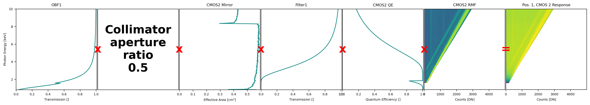
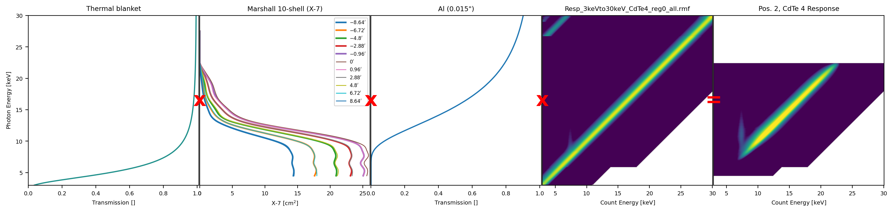
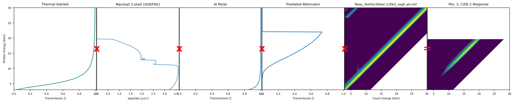
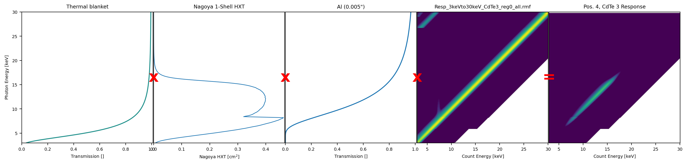
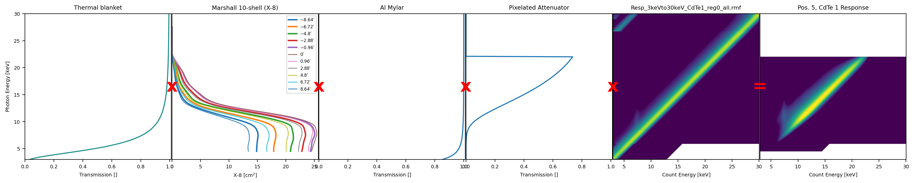

# `response-tools` for FOXSI-4  <span>&#129418;</span>

Repository to manage response elements, originally for the FOXSI-4 sounding rocket mission but it can be extended.

**See below on contributing to the repository.**

**Note:** Although this repositiory can be extanded to any other instrument (e.g., FOXSI-1, -2, and -3), this repository is only currently aimed for FOXSI-4 use.

### Documentation

Documentation can be found in the [Response Tools Data Guide](./Response-Tools-Data-Guide-v1.pdf) and in the [online documentation](https://foxsi.github.io/response-tools/index.html). 

## `response-tools`

A repository to software tools for the response system used for the FOXSI mission in Python (woo, Python). We will include helpful loader functions for the all the response elements and download clients to obtain the files.

The tools being developed in Python should be placed in the `response_tools` folder (note the underscores and not dashes).

There is an "examples" and a "tests" folder. The "examples" folder is a great place to include scripts that show how some of the code in the repository works and the "tests" folder is a fantastic place to put code that tests the tools that have been created.

More information will be placed here with regards as to how this package is recommended to be used.

## Install tips

In order to work with some preliminary data, it is instructive to set up a virtual environment (more information below) and install necessary packages. The suggested way to do this is to create an environment with:

- `conda create -n response-tools-env python==3.12`

(recommend using Python 3.12 just because this has been proven to be stable with the software).

The Python code can then be installed with:

- `pip install -e .`

while in this directory (the `response-tools` directory) containing the `setup.py` file.

Any time the code is updated and, say, you pull it from Github, make sure to perform the `pip install -e .` line from above. This ensures any new changes, updated versions, etc. take effect.

## Namespace

The base `response_tools` namespace includes:

- `~response_tools.contextResponseInfo`
  - The information stored in a [YAML file](./response_tools/response-information/info.yaml) that includes file version information (e.g., the current versions to be used) and can be accessed like a Python dictionary.
- `~response_tools.__version__`
  - The version of the code determined by `response-tools/setup.py`.
    - `0.0.1`: First rendition of the code.

### Examples using the namespace

```python
# importing the module is as easy as:
>>> import response_tools

# can access the YAML file contents in the code as 
>>> print(response_tools.contextResponseInfo[""])
...

# then accessing the version as:
>>> print(response_tools.__version__)
'0.0.1'

>>> print(response_tools.responseFilePath)
'/path/to/response/file/download/location/'
```

## Useful Python tips

Some useful things to keep in mind while using the Python code in this repository.

### Virtual environments

It might be a good idea to look into ([conda](https://conda.io/projects/conda/en/latest/user-guide/tasks/manage-environments.html)) virtual environments if you are not familiar, this includes looking into them yourself or getting in touch with someone to help explain. This requires downloading [miniconda](https://docs.anaconda.com/miniconda/install/#quick-command-line-install) (or just conda if you prefer).

## Response files

There are many response elements for FOXSI-4. Once downloaded, they can be places or found [here](./response_tools/response-information/).

We can describe various aspect like versioned filename (official one to use), original filename, description, etc.

We can group them in which telescope they belonged to in FOXSI-4 and order them with regards to the photon path. This list should be kept up-to-date.

For a historical description of the response files below (old versions, etc.), see the [README in response-information](./response_tools/response-information/README.md).

### Position 0 (SXR, CMOS1)

- **Optical blocking filter:** `"foxsi4_telescope-0_BASIC_optical_blocking_filter_transmittance_v1.fits"`
  - _Description:_
- **Collimator:** `"foxsi4_telescope-0_BASIC_collimator_aperture_ratio_v1.fits"`
- **Optics:** `""`
- **Filter:** `"foxsi4_telescope-0_BASIC_attenuation_filter_transmittance_v1.fits"`
- **Detector response:** ""
  - **Quantum efficiency:** ""



### Position 1 (SXR, CMOS2)

- **Optical blocking filter:** `"foxsi4_telescope-1_BASIC_optical_blocking_filter_transmittance_v1.fits"`
- **Collimator:** `"foxsi4_telescope-1_BASIC_collimator_aperture_ratio_v1.fits"`
- **Optics:** ""
- **Filter:** `"foxsi4_telescope-1_BASIC_attenuation_filter_transmittance_v1.fits"`
- **Detector response:** ""
  - **Quantum efficiency:** ""



### Position 2 (HXR, CdTe4)

- **Thermal blanket:** ""
- **Optics:** `"FOXSI3_Module_X-7_EA_pan_v1.txt"`
- **Filter:** ""
- **Detector response:** ""



### Position 3 (HXR, CdTe2)

- **Thermal blanket:** ""
- **Optics:** ""
- **Filter:** ""
- **Pixelated attenuator:** ""
- **Detector response:** ""



### Position 4 (HXR, CdTe3)

- **Thermal blanket:** ""
- **Optics:** ""
- **Filter:** ""
- **Detector response:** ""



### Position 5 (HXR, CdTe1)

- **Thermal blanket:** ""
- **Optics:** ""
- **Filter:** ""
- **Pixelated attenuator:** ""
- **Detector response:** ""



### Position 6 (Timepix)

- N/A

## Example code

There are a few existing example scripts showing how to use a lot of tools in the repository.

**Python examples:** Python example scripts can be found in response-tools [examples](./examples/) folder which has an associated [README file](./examples/README.md).

## Contributing to the repository

Thank you so much for considering to contribute to the repository! <span>&#127881;</span>

In order to contribute, we ask that you first create your own fork of the repository and then clone that fork to your local machine. Branches of your new fork can be created to develop new features or fix bugs (exciting!). When you are happy with the code in that new branch, a pull request (PR) can be opened which aims to merge the code in your fork's branch into the `main` `foxsi/response-tools` repository. A lot of discussion can be facilitated in an open PR.

**Note:** We aim to _never_ `push` from a local machine to this repository directly. If this happens then it can be very difficult for other contributers to understand what changes are being made and how it affects their own PRs. _If the repository is pushed to directly, in order to help track changes and make them visible to other contributers, the repository will be reverted back to it's state before the push and the undone changes will be asked to be proposed via a PR to then be merged._

## The `response-information` directory

This directory contains context information about the response files that can be shared between a lot of different scripts. E.g., the latest versions of the files the code should be using.

## Versioning

The versioning approach for all code, files, and data products is [semantic versioning](https://en.wikipedia.org/wiki/Software_versioning#Semantic_versioning).

This means that we represent the item with one-three digits indicating `major`.`minor`.`patch` changes made. Files will likely only use the `major` value.

- `major`: Increment to include breaking changes from previous versions.
  - E.g., the file's data changes or the pre-existing code's behaviour is changed and is no longer backwards compatible.
- `minor`: Increment to include new additions to the item.
  - E.g., the file now includes new additional data or the code has new tools.
- `patch`: Increment to include all other small changes.
  - E.g., the file has small details added, like some metadata, or the code has had a couple of small typo fixes.
