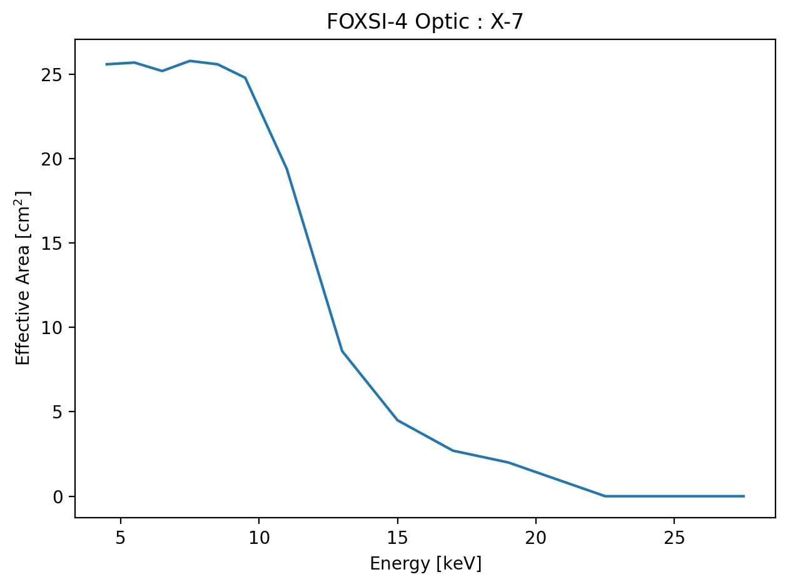

# Response-tools code tips

This page showcases some of the ways the code can be interacted with rather than specific examples of response elements being derived.

## The data-class object

All functions in the `response-tools` code returns a data-class object. The data-class object is here to help keep track of all the metadata of the product a user is working with. Therefore, there is no need to worry about which file the data came from or with what inputs the user previous used to produce the response element. All of this information is stored in the data-class fields.

### Accessing data-class fields

All fields can be accessed with ``[“field_name”]`` or doing ``.field_name`` on the returned object from agiven function. E.g.,

```python
>>> output = response_function()
>>> print(output.fields)
['filename', 'function_path', ...]
```

where `...` represents other fields the `output` object might contain.

We can access the fields in a few different ways, but they are not all seen as equally valid. All thress of the following will access the `filename` associated with `output` from the previous example.

```python
output.filename # recommended
output["filename"] # recommended
output.contents["filename"] # not recommended
```

### Common data-class fields

There are a number of fields common to all data-class types used in the package.

| Field Example    | Description                                                                                                          |
| ---------------- | -------------------------------------------------------------------------------------------------------------------- |
| `contents`       | Returns the data-class contents in a dictionary format.                                                              |
| `fields`         | Returns a list of all the fields contained in the data-class.                                                        |
| `filename`       | Returns the file name and path source of the output.                                                                 |
| `function_path`  | Returns a string that tracks the functions used to produce the output.                                               |
| `print_contents` | This should nicely print the output of the `contents` field and make it easier to read (_does not_ return anything). |

### Different data-class fields

| Field Example         | Description                                                                                                                                    |
| --------------------- | ---------------------------------------------------------------------------------------------------------------------------------------------- |
| `attenuation_type`    | A descriptive label for the attenuator.                                                                                                        |
| `detector`            | A descriptive label for the detector.                                                                                                          |
| `detector_response`   | A unit aware matrix (e.g., counts/photon or DN/photon) describing a detector's photon-to-observable probability.                               |
| `effective_areas`     | A unit aware array (likely cm<sup>2</sup>) of the optic’s effective area.                                                                            |
| `elements`            | A tuple of the data-classes used to create the one containing this field.                                                                      |
| `input_energy_edges`  | A unit aware array (likely in keV) of the bin edges of a matrix response. The “input” edges referring to the incoming photon energies.         |
| `mid_energies`        | A unit aware array (likely in keV) of the energies at which the data was evaluated.                                                            |
| `model`               | A boolean indicating whether the returned data is from a model (`True`) or measurement (`False`).                                              |
| `off_axis_angle`      | A unit aware value (likely in arc-minutes) of the off axis angle at which the data was evaluated.                                              |
| `optic_id`            | A descriptive label for the optic.                                                                                                             |
| `output_energy_edges` | A unit aware array (likely in keV or DN) of the bin edges of a matrix response. The “output” edges referring to the exiting detector channels. |
| `quantum_efficiency`  | A unit aware array (likely dimensionless) of the detector’s quantum efficiency.                                                                |
| `response`            | A unit aware array, likely the combination of several telescope components to make part or the whole of a telescope’s response.                |
| `response_type`       | Describes whether the response in the data-class is an ARF, RMF, or DRM.                                                                       |
| `telescope`           | Details the telescope to which the data, or components of the data, belongs.                                                                   |
| `times`               | A unit aware list (likely in seconds) of the times at which the data was evaluated and then processed.                                         |
| `transmissions`       | A unit aware array (likely dimensionless) of the attenuator’s transmission.                                                                    |

Inspecting a returned output and observing a subset of these fields should make it extra clear to a user as to exactly what they are handling when it comes to the output of the function.

## Plotting: data-class and units

After you have your object(s), you might want to plot the contents for visual inspection. We can use the information in the data-class object to avoid a lot of manual bookkeeping jobs like tracking units.

A user will likely be happy just getting the ARF, RMF, and DRM and will be on their way to do science (e.g., spectral fitting) with the product. However, a user might want to actually inspect what they have before running off. Even if they are not so familiar with and ARF and RMF, they still might be able to pick up on something that is not quite what they expect it to be. At the very least a user might want to ask very sensible questions about what they are working with as these products will heavily influence any spectral fitting results.

We can plot the response function outputs similar to any other normal way in Python. Here we use the `output` example from earlier and we assume this was for an optic's effective area:

```python
import matplotlib.pyplot as plt

plt.figure()
plt.plot(output.mid_energies,
         output.effective_areas)
plt.xlabel(f"Energy [{output.mid_energies.unit:latex}]")
plt.ylabel(f"Effective Area [{output.effective_areas.unit:latex}]")
plt.title(f"FOXSI-4 Optic : {output.optic_id}")
plt.show()
```

As a brief example, we'll show what this code would plot if the optic being looked at is the MSFC heritage X-7 optic. The plot would look something like this:


