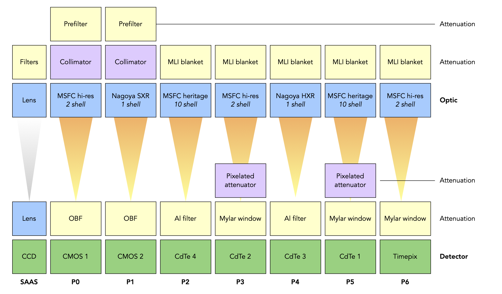

# FOXSI-4 Instrumentation &#129418;

Details on the make-up of the FOXSI-4 instrument. This page will help a user decide what response components they want when using the response files and/or [Response-tools](https://foxsi.github.io/response-tools) code.

More comming soon...

## FOXSI-4 components and positions

More comming soon...

