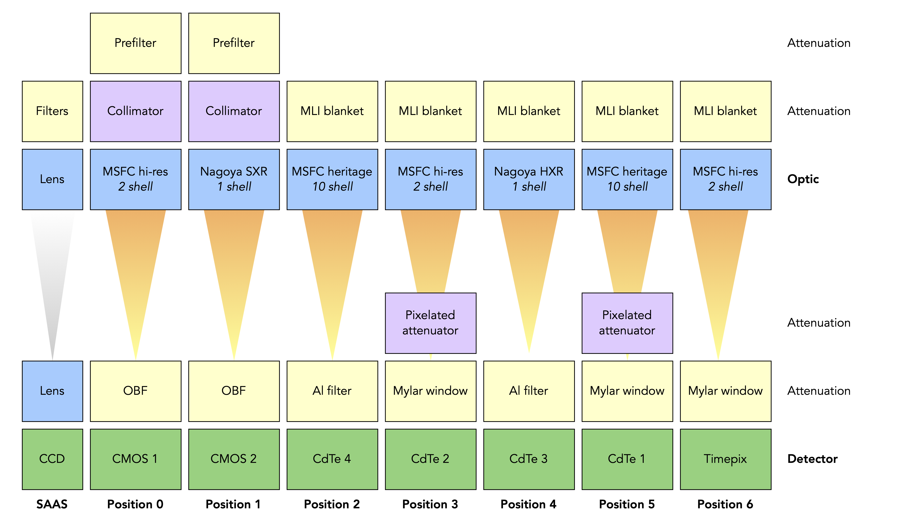

# FOXSI-4 Instrumentation &#129418;

Details on the make-up of the FOXSI-4 instrument. This page will help a user decide what response components they want when using the [response files](https://foxsi.space.umn.edu/data/response/response-components/) and/or [Response-tools](https://foxsi.github.io/response-tools) code.

## Overview

The FOXSI-4 instrument is composed of seven independent X-ray telescopes. Each of these seven includes a direct-focusing X-ray optic module, a focal plane detector, and some attenuation material along the optical path. The following figure summarizes the focusing optics, attenuation, and detector elements that comprise each telescope:

Light enters the top of the figure and is detected at the bottom. The telescopes are identified by their **position** number (0 through 6). This nomenclature for telescope positions is used in FOXSI documentation throughout this package and beyond.

This package provides access to the response for each telescope (columns in the above diagram). If desired, you can also access individual response components (boxes in the above diagram).

## FOXSI-4 telescopes

If you'd like to do some analysis on FOXSI-4 data, which telescope(s) should you use? This table may help you make up your mind:
| Telescope | Detector | Optics      | Attenuation          | Collimator | Energy range | Energy resolution | FWHM      |
| :-------: | -------- | ----------- | -------------------- | ---------- | ------------ | ----------------- | --------- |
| **0**     | CMOS     | MSFC 2-sh   | OBF + Prefilter      | AR = 1:290 | 0.8–10 keV   | 0.4 @ 10 keV      | 3.4"      |
| **1**     | CMOS     | Nagoya 1-sh | OBF + Prefilter      | AR = 1:200 | 0.8–10 keV   | 0.4 @ 10 keV      | 1.5"      |
| **2**     | CdTe DSD | MSFC 10-sh  | 381 µm Al            | —          | 4–20 keV     | 0.8 @ 14 keV      | 7.2–11.4" |
| **3**     | CdTe DSD | MSFC 2-sh   | Pixelated attenuator + Mylar | —  | 4–20 keV     | 0.8 @ 14 keV      | 6.1–10.8" |
| **4**     | CdTe DSD | Nagoya 1-sh | 381 µm Al            | —          | 4–20 keV     | 0.8 @ 14 keV      | 5.3–10.3" |
| **5**     | CdTe DSD | MSFC 10-sh  | Pixelated attenuator + Mylar | —  | 4–20 keV     | 0.8 @ 14 keV | 7.2–11.4" |
| **6**     | Timepix[^1] | MSFC 2-sh | Mylar                | —          | 5–20 keV     | 6 @ 60 keV        | 6.9"      |

[^1]: No flight data from Timepix is available.

## FOXSI-4 components
