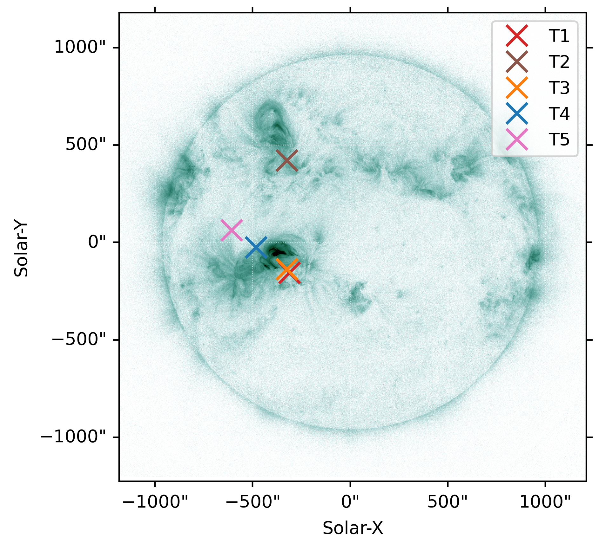
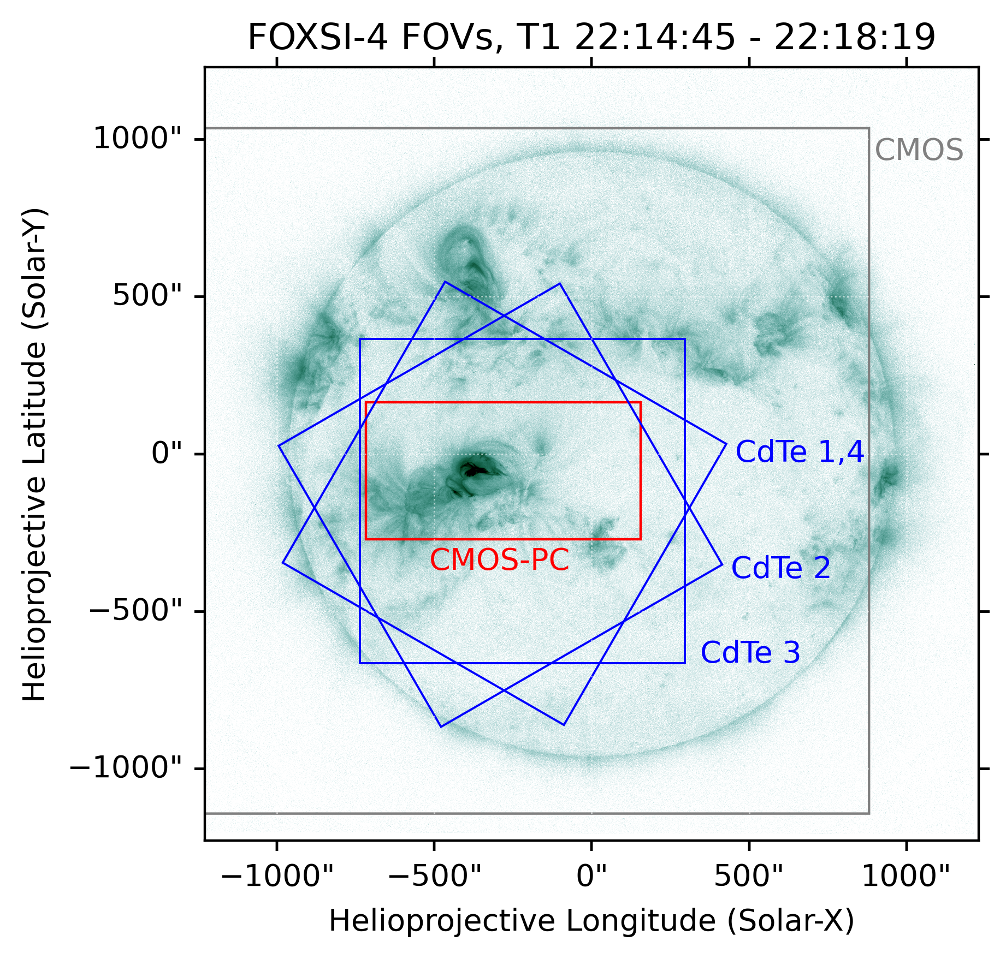
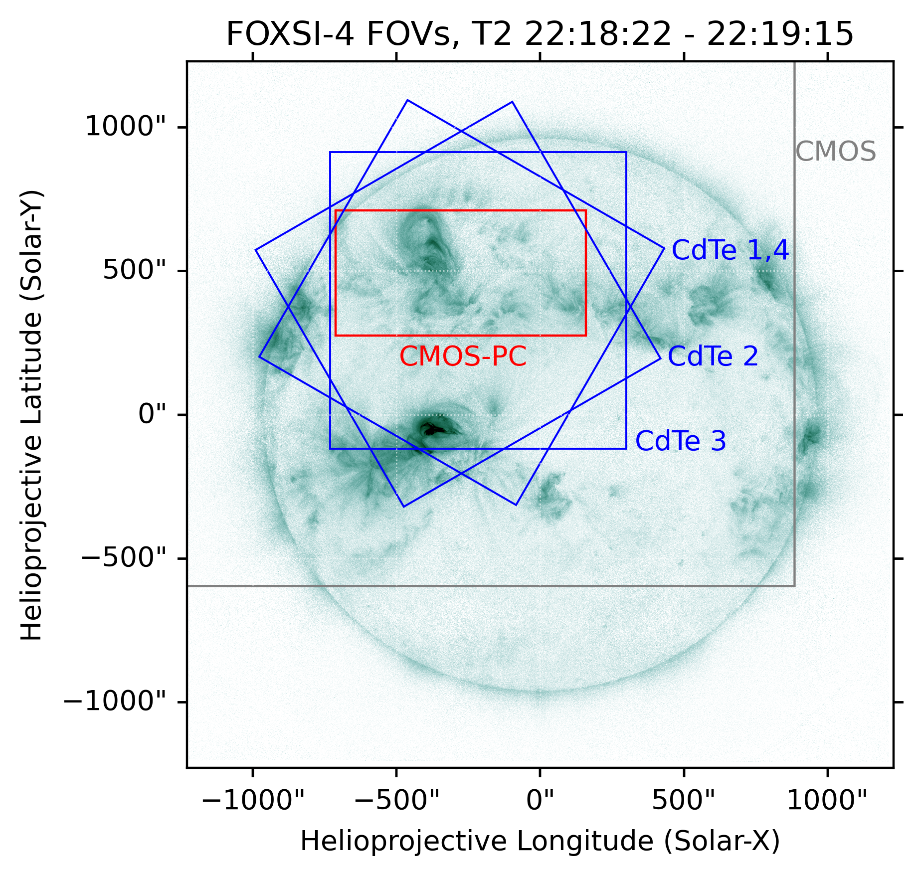

# FOXSI-4 Observation &#129418;

Details on the the FOXSI-4 flight and observation. This page will help a user decide and understand the inputs they need for their relevant response components when using the response files and/or [Response-tools](https://foxsi.github.io/response-tools) code.

## Overview

FOXSI-4 was launched from the Poker Flat Research Range in Alaska on April 17, 2024, at 22:13 UT. Solar observations began at 22:14:40 UT and lasted for 5.8 minutes. The instrument first observed an M1.6-class flare (primary target) near AR 13638/13643 for ~3.5 minutes, then pointed to a northern active region (AR 13639) for ~1 minute before returning to the primary flare for the final minute of the observation. (Note: pointing adjustments occurred during the last minute.) All telescopes equipped with a CMOS detector or CdTe strip detector (i.e., Telescopes 0–5) collected good scientific data, but Telescope 6's data were unfortunately unusable due to a Timepix detector issue.

## Choosing a time range

*Relevant for functions with inputs like: `time_range`.*

The time range is important for calculating the atmospheric transmission, which is a key component of the ARF. Depending on the objectives of the analysis, the user may select the appropriate time range using the information provided below:

**Observation time intervals with stable pointing for more than a few seconds:**

|    | Time interval (UT) | Seconds from launch | Target | Feature(s) within CdTe FOV |
|:--:|:----------------:|:----------:|:----------------:|:----------------:|
| T1 | 22:14:45-22:18:19 | 105-319 |  Primary flare | Primary flare |
| T2 | 22:18:22-22:19:15 | 322-375 | Active region | Active region[^1], primary flare[^2] |
| T3 | 22:19:39-22:20:08 | 399-428 | Primary flare | Primary flare, microflare |
| T4 | 22:20:12-22:20:22 | 432-442 | Primary flare | Primary flare, microflare |
| T5 | 22:20:23-22:20:30 | 443-450 | Primary flare | Primary flare, microflare |

[^1]: Very few HXR photons were observed in CdTe strip detectors.
[^2]: Partially observed in CdTe 1, 3, and 4; fully observed in CdTe 2.

The figure below shows the SPARCS pointing coordinates for each observation interval (note: minor pointing variations are ignored).

The following figures show the approximate fields of view (FOVs) of different telescopes during the first two observation intervals. (See the later section for more information based on the CdTe quicklook images.)

*Blue: CdTe detector FOV; red: CMOS photon-counting region; grey: CMOS FOV.*

## Choosing a source location

*Relevant for functions with inputs like: `off_axis_angle`, `region`, `pitch`.*

The source location is important for determining the off-axis angle used in the ARF calculation and for identifying which part of the detector those photons hit, which is relevant to the RMF.

For CdTe strip detectors, users can refer to the following plots to find the corresponding off-axis angle and detector region/pitch for each observation interval. In each plot, concentric circles mark 1-arcminute increments from the detector center. Yellow lines separate detector regions with different Pt-side pitch sizes: Region 0 (60 μm pitch), Region 1 (80 μm pitch), and Region 2 (100 μm pitch), from the center to the edge of the detector.

*Note: The optical axis is currently assumed to align with the detector center, which is likely not true. This figure will be updated in the future.*

## Choosing energies
*Relevant for functions with inputs like: `mid_energies`.*

<b style='color:#e16b27 !important;'>For the vast majority of uses,</b> the energies <em style='color:#e16b27 !important;'>should</em> come from those defined by the redistribution matrix (RMF) relevant to the telescope a user is investigating. If a user is only working with 1D response elements (e.g., effective areas, transmission, etc.) they might want to supply their own energies; <b style='color:#e16b27 !important;'>however, a great deal of care should be taken</b>.

During the FOXSI-4 flight, the CdTe strip detectors observed photons in the 4-20 keV range.
