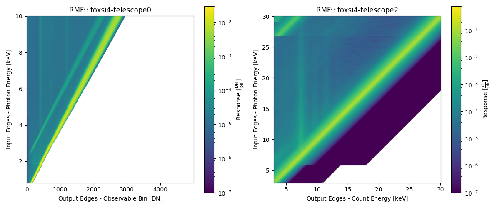
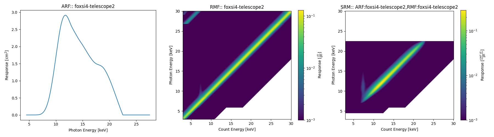

# What Is a Response? <span>&#129418;</span>

There are many elements to a response and there are many important derived products, not to mention the units (uhh! <span>&#128580;</span>). Here we will go into some detail on what different response components mean so it is clearer what a user might actually be working with.

Each telescope component has a response that impacts the photon distribution eventually being read off of the detector (e.g., the optics module, any attenuators, and the detector's own efficiency). All of these elements need to be combined for various scientific spectral analysis investigations. therefore, it is common to discuss the respons eof the telescope as a whole in terms of its **Ancillary Response Function/File (ARF)**, its **Redistribution Matrix Function/File (RMF)**, and its **Spectral Response Matrix (SRM)**.

It can be difficult to find nice information on these combined elements. It usually comes down to how active individual instrument teams are when uploading their own documentation. [The NICER team is a good example](https://heasarc.gsfc.nasa.gov/docs/nicer/analysis_threads/arf-rmf/#:~:text=Introduction) when documenting their ARF/RMF pipeline for spectral analysis.

## What is an ancillary response function/file (ARF)?

The ARF, at heart, is the combination of an instrument's 1D transmission, effective area, and efficiency information that affect an incoming photon. For example, it can be easily computed for a simple telescope (only an optic and detector) by multiplying together the optic's effective area and the detector's efficiency. The units of the ARF will, therefore, be cm<sup>2</sup>.

FOXSI-4 contains 7 telescopes (telescopes 0-6), all with different combinations of components. Below is an example of the ARF being created from telescope 2's 1D response components:

- Thermal blanket -> Marshall 10-shell X-7 -> Al (0.015")


These elements are then multiplied together and combined to produce the ARF:


Comparing the two figures, a user can see different features in the ARF and might be able to attribute those features to the individual components (e.g., the thermal blanket, the Marshall 10-shell X-7 optics, and/or the Al attenuator). A user can then visually see what photons of different energies experience travelling through the telescope on their way to the detector.

For a coded runthrough of creating an ARF, see the [Create an ARF from scratch](https://foxsi.github.io/response-tools/auto_examples/plot_arf_from_scratch.html#sphx-glr-auto-examples-plot-arf-from-scratch-py) example in the example gallery.

<span style="color:#e16b27">For scientific analysis, a user may also consider effects outside the telescope, such as atmospheric transmission/attenuation, which would be incorporated into the ARF.</span>

## What is a redistribution matrix function/file (RMF)?

The RMF is a matrix that contains the energy redistribution information of the detector, this is the photon-to-count conversion probability. An incoming photon of energy $\epsilon$ can be detected by the telescope's sensor as a count with an energy $\lesssim\epsilon$ (say, $E$) due to scattering, detection efficiency, and energy resolution. Therefore, the energies we are interested in are the ones defined for the RMF creation. I.e., the defined photon energies/input axis controls the energies the ARF and photon models should be evaluated and the defined count bin energies/observable bins/output axis controls the binning of the observed data.

Example RMFs for the CdTe and CMOS can be seen below (see the [Example FOXSI-4 RMFs](https://foxsi.github.io/response-tools/auto_examples/plot_rmf_examples.html#sphx-glr-auto-examples-plot-rmf-examples-py) example in the example gallery) which show the conversion probability of a photon being recorded as detector observable (i.e., either a count with a calibrated energy or DN):



The RMF is a single product made of many measurements or simulations and should have a strong response along the diagonal ($\epsilon$=$E$). The RMF will contain features at $E<\epsilon$ produced by different interactions. E.g., the escape peak for each energy will run parallel to the diagonal, elemental fluorescence lines will be vertical at constant $E$, and so on.

## What is a spectral response matrix (SRM)?

The SRM describes the total response of the telescope in question. It takes into account both the ARF and the RMF.

### How does combining the ARF and RMF into an SRM work?

The SRM is the combination of the ARF and RMF:

```{math}
SRM = ARF \times RMF \quad \textrm{and} \quad SRM_{a, b} = ARF_{a}*RMF_{a,b}
```

where $a$ and $b$ are the elements along the input and output RMF axis, respectively.

Using the SRM, a user can perform a variety of scientific analysis, such as forward fitting and spectral inversion. The SRM describes the link between the incoming photon spectrum and the observed data spectrum.

For example, for forward fitting, if a user has a model photon spectrum ($M_{photon}$) evaluated for the SRM input energy bins then they are able to obtain a model telescope observable spectrum (e.g., a count or DN spectrum):

```{math}
M_{observable} = M_{photon} \# SRM \quad \textrm{and} \quad M_{observable, b} = \sum_{a=0}^{n} M_{photon, a} \cdot SRM_{a, b}
```

where $M_{observable}$ is the model observable spectrum that can be compared to the measured observable spectrum from, say, the flight. A user can make use of spectral fitting software for this analysis:

- [Sunkit-spex](https://github.com/sunpy/sunkit-spex) (`Python`)
- [OSPEX](https://hesperia.gsfc.nasa.gov/ssw/packages/spex/doc/ospex_explanation.htm) (`IDL`)
- [XSPEC](https://heasarc.gsfc.nasa.gov/docs/software/xspec/) (Multiple interfaces)

An example of Telescope 2's ARF, RMF, and SRM is given below to show how the two former elements are combined into the latter (see the [Generating and plotting ARFs, RMFs, and SRMs](https://foxsi.github.io/response-tools/auto_examples/plot_arf_rmf_srm.html#sphx-glr-auto-examples-plot-arf-rmf-srm-py) example in the example gallery).


