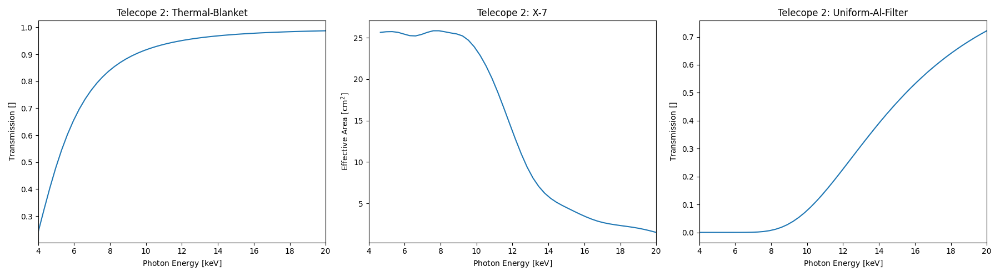
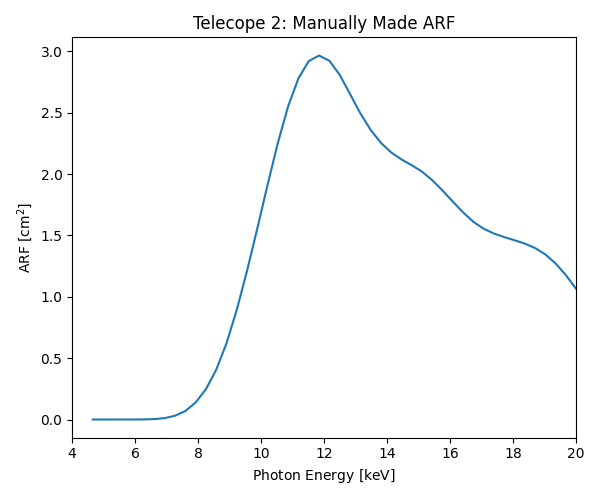

# What Is a Response? &#129418;

There are many elements to a response and there are many important derived products, not to mention the units (uhh! &#128580;). Here we will go into some detail on what different response components mean so it is clearer what a user might actually be working with.

Each telescope component has a response that impacts the photon distribution eventually being read off of the detector (e.g., the optics module, any attenuators, and the detector's own efficiency). All of these elements need to be combined for various scientific spectral analysis investigations. therefore, it is common to discuss the respons eof the telescope as a whole in terms of its **Ancillary Response Function/File (ARF)**, its **Redistribution Matrix Function/File (RMF)**, and its **Spectral Response Matrix (SRM)**.

For scientific analysis on the data, a user may also want to consider effects outside the telescope, such as atmsopheric transmission/attenuation, which would likely be incorporated into the ARF component.

It can be difficult to find nice definitions for these combined elements. It usually comes down to how active individual instrument teams for missions are when uploading their own documentation. [Here is a nice example from the NICER team](https://heasarc.gsfc.nasa.gov/docs/nicer/analysis_threads/arf-rmf/#:~:text=Ancillary%20Response%20Files%20(ARFs).&text=The%20ARF%20is%20a%20multiplicative,into%20an%20observed%20detector%20count) when documenting their ARF and RMF pipeline for spectral analysis.

## What is an ancillary response function/file (ARF)?

The ARF, at heart, is the combination of an instrument's 1D transmission, effective area, and efficiency information. For example, it can be easily computed for a simple telescope (only an optic and detector) by multiplying together the optic's effective area and the detector's efficiency.

FOXSI-4 contains 7 telescopes (telescopes 0-6), all with different combinations of components. Below is an example of the ARF being created from telescope 2's 1D response components:

- Thermal blanket -> Marshall 10-shell X-7 -> Al (0.015")

These elements are then multiplied together and combined to produce the total ARF:

Comparing the two figures, a user can see different features in the ARF and might be able to attribute those features to the individual components (e.g., the thermal blanket, the Marshall 10-shell X-7 optics, and/or the Al attenuator). A user can then visually see what photons of different enegies experience travelling through the telescope on their way to the detector.

## What is a redistribution matrix function/file (RMF)?

Coming soon...

## What is a spectral response matrix (SRM)?

Coming soon...

### How does combining the ARF and RMF into an SRM work?

Coming soon...
